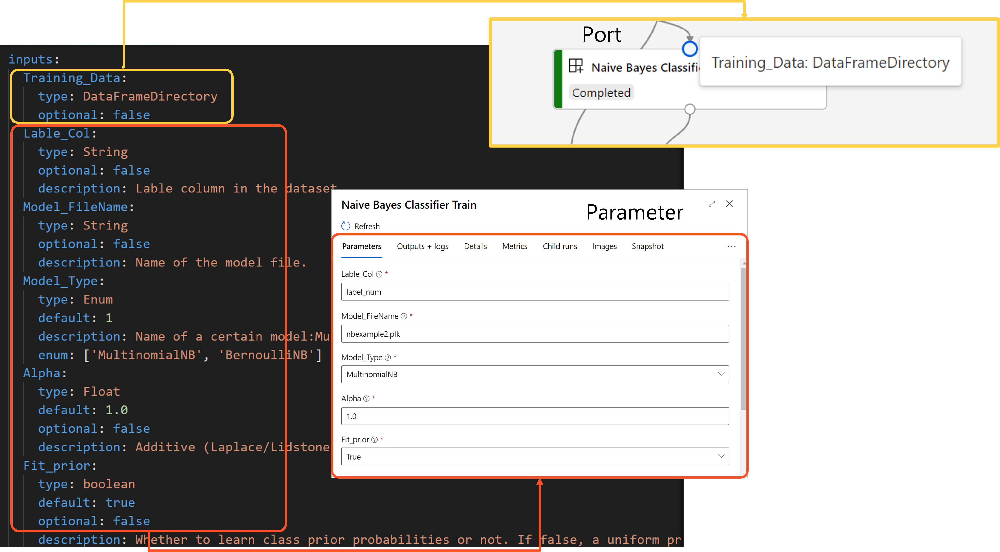
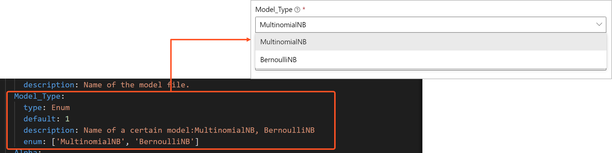

# Azure ML Designer Custom Component: Naive Bayse Train
This component is a Naive Bayse Train for Text classification. In the train step will get input dataframe that contains text column and label column. This train step allow user to select 2 types of algorithm: **MultinomialNB** and **BernoulliNB**. As this will use with text classification there are 2 additional step in training pipeline that consist of **CountVectorizer** and **TfidfTransformer**. 
Once training is done it will save the training pipeline in pickle format as the ModelFileName given in UI parameter. 

## Input Example:
This step require input datarame that contains text column and label column (as numeric type).
Below is screen short of input exaple:


## Parameter:
For creating Custome component there are 2 mains files that required:
1. YAML file that define schema for input and output that will use to create UI where user can interact with. For detail Schema spec, [please refer to schema reference here](https://docs.microsoft.com/en-us/azure/machine-learning/reference-yaml-component-command) 

2. Python script that will get input that you defined in YAML file do some processing and return an output. 

## YAML input Port and Parameter UI:
Port & Parameters between UI and Yaml Spec. From component UI, there are 2 types of inputs/outputs: Ports and Parameters. When you use DataFrameDirectory or AnyDirectory as an input/output type, it will show as port. When you use basic type, like integer, float or string, it will show in parameters right panel. 
 

In Python Code you can define variable to get parameter from UI
```python
## Parse args
parser = argparse.ArgumentParser("MultinomialNBTraining")
parser.add_argument("--Training_Data", type=str, help="Training dataset")
parser.add_argument("--Lable_Col", type=str, help="Lable column in the dataset.")
parser.add_argument("--Model_Type", type=str, default='MultinomialNB', help="Name of a certain Naive Bayes Model")
parser.add_argument("--Alpha", type=float,default=1.0, help="Additive (Laplace/Lidstone) smoothing parameter (0 for no smoothing).")
parser.add_argument("--Fit_prior", type=bool, default=True, help="Whether to learn class prior probabilities or not. If false, a uniform prior will be used.")
parser.add_argument("--Model_FileName", type=str, help="Name of the model file.")
parser.add_argument("--Model_Path", type=str, help="Path to store MultinomialNB model file in pickle format.")
args = parser.parse_args()
```

## Dropdown Box UI for user select option:
In case you want user to select an option as dropdown in parameter UI. For example in this train step, I allows user to choose algorithm between **MultinomialNB** and **BernoulliNB**. You can define in YAML file with data type Enum as below example.

 

When get this type of parameter simple get as string type:

```python
parser.add_argument("--Model_Type", type=str, default='MultinomialNB', help="Name of a certain Naive Bayes Model")
```