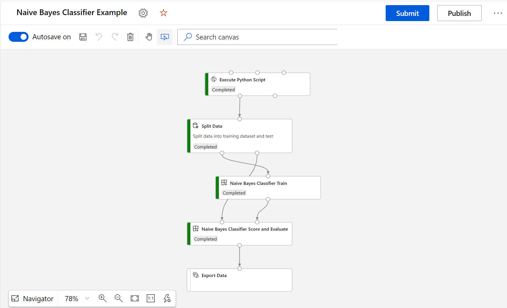

# Azure ML Designer Custom Component Example
This repo aims to share how to build Custom Component to use in Azure ML Designer. In case that to have repeatable step or process you can create a Custom Component. In this case I created 2 custom compenent for Naive Bayes Training, and Scoring and Evaluation.
## Training
In training step consists of 2 algorithms MultinomialNB and BernoulliNB for Text classification where user can select which algorithms they prefer. For detail information, [please see here](./NaiveBayse/README.md)

## Scoring and Evaluation
In Scoring and Evaluation step user can select to choose between perform both scoring and evaluation or score only. For detail information, [please see here](./ScoreAndEvaluate/README.md)

## Naive Bayse Example
 

## References:
* [How to Install Custom Component](https://github.com/Azure/AzureMachineLearningGallery/blob/main/tutorial/tutorial1-use-existing-components.md)
* [What is an Azure Machine Learning component (preview)?](https://docs.microsoft.com/en-us/azure/machine-learning/concept-component) 
* [CLI (v2) command component YAML schema](https://docs.microsoft.com/en-us/azure/machine-learning/reference-yaml-component-command) 