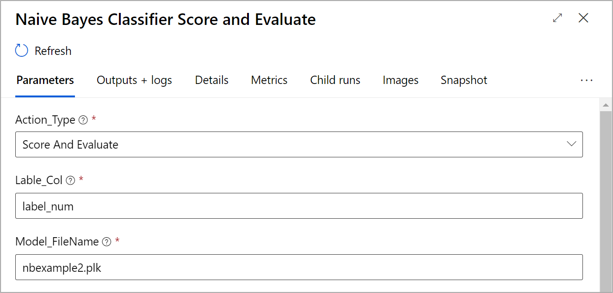

# Azure ML Designer Custom Component: Naive Bayse Score and Evaluation
This component is a Naive Bayse Score and Evaluation. After you train the model you can use this step to score with new dataset or score and evalute with the test dataset.

## Parameter:
Below are inputs parameter for Naive Bayse Score and Evaluation:

1. Action Type: user can choose between **Score Only** or **Socre and Evaluate**. It will get dataframe and model path as inputs in case you choose Score and Evaluate. If you choose score only, you can give only model path.

2. Label Column: this will require only when you choose **Socre and Evaluate**. In case you select **Score Only**, please enter "None" instead. 

3. Model File Name: this should be the same as model file name in your train step. 

